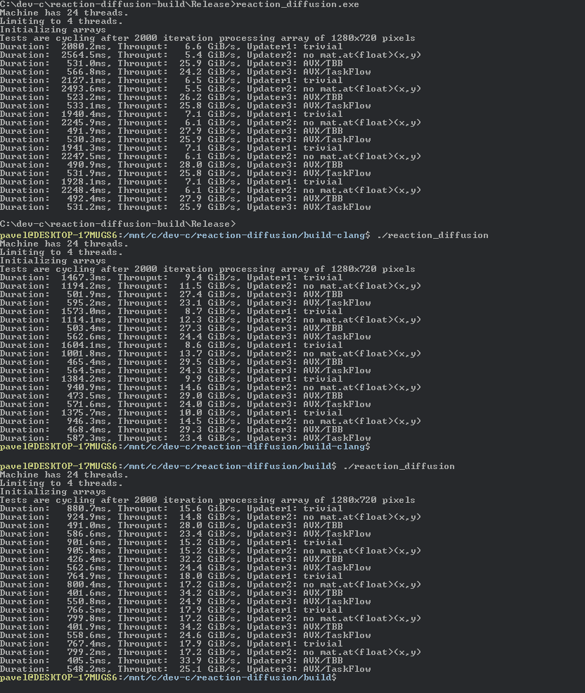

# What the hell is this?


# Why it exists?

* To try ChatGPT (first commit, AVX code)
* It looks cool :-)
* Playground for trying some libraries (TaskFlow)
* Playground for trying AVX instuction set
* Playground for high performance computing / image processing and parallelism

# Links

* https://mrob.com/pub/comp/xmorphia/index.html
* https://www.karlsims.com/rd.html
* https://github.com/topics/reaction-diffusion
* https://linusmossberg.github.io/reaction-diffusion/

# Requirements

## Knowledge
* CMake basics
* C++ basics

## Third party libraries

* OneTBB (Intel's OneAPI Thread Building Blocks) https://github.com/oneapi-src/oneTBB/releases
* OpenCV https://opencv.org/releases/
* FmtLib https://github.com/fmtlib/fmt (since v0.2)
* TaskFlow 3.4.0 https://github.com/taskflow/taskflow (since v0.5)

FmtLib is automatically fetched by CMake. 

TaskFlow is header-only library and most of it is included.

## Windows specific

OpenCV must be downloaded as exe file, which is self-extracting archive or compiled from sources.

OneTBB must be downloaded and extracted, possibly compiled from sources.

Editing CMakeLists.txt file is needed on Windows, as path to libraries are hardcoded there.

Since 2023-02-17, DLLs are copied to directory automatically. Finally!

Build was tried only in Visual Studio 2019 and 2022, it works in Visual Studio Code, but requires Visual Studio build tools.

## Specific for Linux or FreeBSD (and VirtualBox)


To install prerequisites run the following commands as root

| System | Command |
|---|---|
| FreeBSD | `pkg install cmake opencv onetbb` |
| Ubuntu  | `apt install cmake libtbb-dev libopencv-dev` |
| OpenSuse | `zypper install cmake tbb-devel opencv-devel` |

Then compile sources
```
$ cd reaction-diffusion-cpp
$ cmake -DCMAKE_BUILD_TYPE=Debug . -B build
$ cd build
$ make
$ ./reaction_diffusion
```

NOTE: CMAKE_BUILD_TYPE is optional. Can be `Debug` or `Release`

There are is a problem that AVX/FMA instruction sets are not supported in VirtualBox.
* `-march=x86-64-v3` program compiles and crashes, no matter if program has enabled instric instructions or not
* `-march=native` is ok, if AVX instructions are disabled (see `#define HAS_AVX` in the code)

# Performance notes



Performance tested on Ryzen 5900X (12C/24T) with 64MB RAM, usually on 1280x720 data with program compiled by MSVC 2022 Community Edition.

On a single core, AVX code is roughly 5.5 times faster, but both TBB and TaskFlow have some overhead.

Updater2 is slower, but faster in Debug. Uses different pointer arithmetic.

Updater3 and Updater4 are fastest, but Updater1 can be fastest, when all CPU cores are used.

Data are 32bit float and two images are updated in each iteration. One test batch consists of 2000 iterations. This gives 2000x2x4x1280x720 bytes processed per iteration - each batch processes 14.74GB of data (yes, exacly one million floppy discs!). Doing so in 560ms means data throughput of 26GB/s.
According to various sources (e.g. https://www.cpu-monkey.com/en/cpu-amd_ryzen_9_5900x) memory bandwidth is 48-56GB/s. Using just two CPU cores and AVX code is almost enough. 4 cores seem optimal. Above that slow algorithms have some benefits, fast ones are getting worse and difference between 3 and 24 threads negligible.

(Not so) surprisingly, GCC code is fastest, Clang is 2nd, Microsoft C++ compiler is the worst.

# ChangeLog

### v0.7

* Improvement in CMakeLists.txt
* Linux, FreeBSD compatibility

### v0.6

* 3rd updater slighly improved
* Documentation update
* Some changes in coefficients, different pattern

### v0.5 

* 4th updater, adds TaskFlow for parallelism (mostly for curiosity)

### v0.4

* Code switched to generate long video (30s from million iterations)

### v0.3

* 3rd updater, faster processing using AVX instruction set (close to memory throughput bottleneck, more threads won't help)

### v0.2

* 2nd updater, speed test

### v0.1

* Somewhat working version, generates video frames
