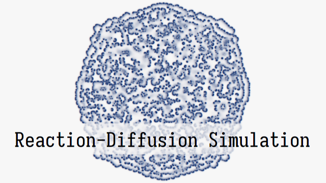

# What the hell is this?



# Why it exists?

* To try ChatGPT (first commit, AVX code)
* It looks cool :-)
* Playground for trying some libraries (TaskFlow)
* Playground for trying AVX instuction set
* Playground for high performance computing / image processing and parallelism

# Links

* https://mrob.com/pub/comp/xmorphia/index.html
* https://www.karlsims.com/rd.html
* https://github.com/topics/reaction-diffusion
* https://linusmossberg.github.io/reaction-diffusion/

# Requirements:

* OneTBB (Intel's OneAPI Thread Building Blocks) https://github.com/oneapi-src/oneTBB/releases
* OpenCV https://opencv.org/releases/ (open exe as zip, unpack)
* FmtLib https://github.com/fmtlib/fmt (since v0.2, fetched by CMake)
* TaskFlow 3.4.0 https://github.com/taskflow/taskflow (since v0.5, partially included, headers only)

Editing CMakeLists.txt file is needed (i hardcoded my paths to libraries there)

These DLLs must be copied into directory with binary manually from

```
opencv-4.7.0\build\x64\vc16\bin 
oneapi-tbb-2021.7.0\redist\intel64\vc14\
```
to 
```
Release/opencv_world470.dll
Release/tbb12.dll
Debug/opencv_world470d.dll
Debug/tbb12_debug.dll
Debug/tbbmalloc_debug.dll
```
or `RelWithDbgInfo`

Sorry, for the invenience I tried one hour to create CMake's postbuild step 

# Notes

```
Machine has 24 threads.
Limiting to 4 threads.
Initializing arrays
Tests are cycling after 2000 iteration processing array of 1280x720 pixels
Duration: 2201.057ms Updater1: trivial
Duration: 2945.879ms Updater2: no mat.at<float>(x,y)
Duration: 556.323ms Updater3: AVX/TBB
Duration: 589.025ms Updater3: AVX/TaskFlow
Duration: 2098.713ms Updater1: trivial
Duration: 2966.754ms Updater2: no mat.at<float>(x,y)
Duration: 570.992ms Updater3: AVX/TBB
Duration: 593.895ms Updater3: AVX/TaskFlow
Duration: 2220.472ms Updater1: trivial
Duration: 3099.920ms Updater2: no mat.at<float>(x,y)
Duration: 579.854ms Updater3: AVX/TBB
Duration: 598.637ms Updater3: AVX/TaskFlow
Duration: 2169.823ms Updater1: trivial
Duration: 2941.072ms Updater2: no mat.at<float>(x,y)
Duration: 560.545ms Updater3: AVX/TBB
Duration: 576.449ms Updater3: AVX/TaskFlow
Duration: 2143.775ms Updater1: trivial
Duration: 2917.309ms Updater2: no mat.at<float>(x,y)
Duration: 558.069ms Updater3: AVX/TBB
Duration: 606.300ms Updater3: AVX/TaskFlow
```

Performance tested on Ryzen 5900X (12C/24T) with 64MB RAM, usually on 1280x720 data with program compiled by MSVC 2020 CE.

On a single core, AVX code is roughly 5.5 times faster, but both TBB and TaskFlow have some overhead.

Updater2 is slower, but faster in Debug. Uses different pointer arithmetic.

Updater3 and Updater4 are fastest, but Updater1 can be fastest, when all CPU cores are used.

Data are 32bit float and two images are updated in each iteration. One test batch consists of 2000 iterations. This gives 2000x2x4x1280x720 bytes processed per iteration - each batch processes 14.74GB of data (yes, exacly one million floppy discs!). Doing so in 560ms means data throughput of 26GB/s.
According to various sources (e.g. https://www.cpu-monkey.com/en/cpu-amd_ryzen_9_5900x) memory bandwidth is 48-56GB/s. Using just two CPU cores and AVX code is almost enough. 4 cores seem optimal. Above that slow algorithms have some benefits, fast ones are getting worse and difference between 3 and 24 threads negligible.

# ChangeLog

### v0.6

* 3rd updater slighly improved
* Documentation update
* Some changes in coefficients, different pattern

### v0.5 

* 4th updater, adds TaskFlow for parallelism (mostly for curiosity)

### v0.4

* Code switched to generate long video (30s from million iterations)

### v0.3

* 3rd updater, faster processing using AVX instruction set (close to memory throughput bottleneck, more threads won't help)

### v0.2

* 2nd updater, speed test

### v0.1

* Somewhat working version, generates video frames
